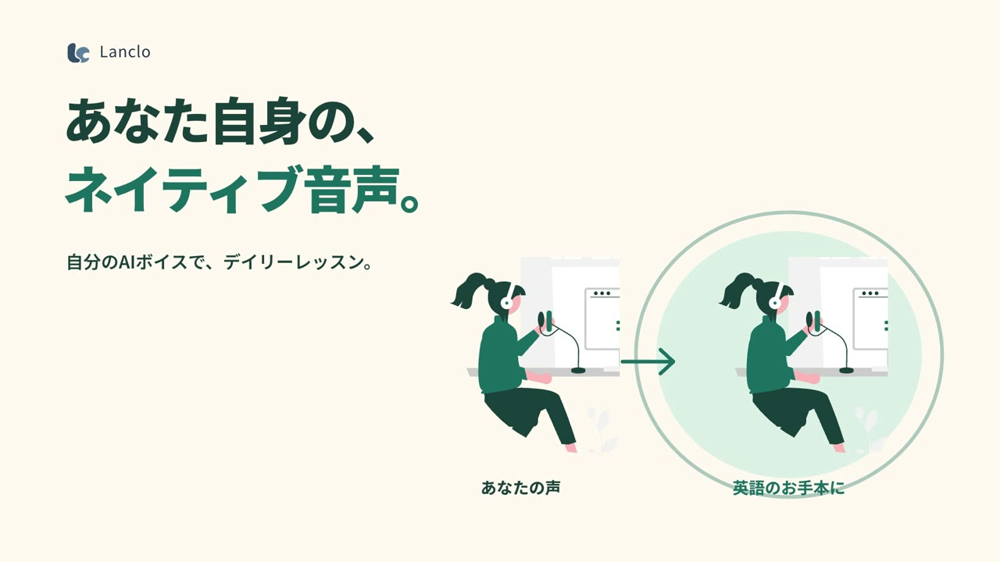

<div align="center">

# Tetsuya Creative Motions

[日本語](README.ja.md) · **English**

**Films, and how they were made.**

A portfolio of motion work made with code and AI. Finished films sit alongside their scripts, prompts, creative decisions, and editable source.

[▶ Watch the gallery](https://videos.maepace.com/en/) · [Films](#films) · [Styles](styles/README.md) · [Re-edit a film](docs/REPRODUCE.md)

</div>

## Films

[](https://videos.maepace.com/en/films/lanclo-daily/)

**Lanclo — Your voice. Your daily English.** · 1:09 · Japanese audio

Your own AI voice, ten personalized questions, and daily news that becomes English learning material.

[Watch & read the making of](https://videos.maepace.com/en/films/lanclo-daily/) · [Production files](films/lanclo/README.md)

The visuals are authored in HTML/SVG and GSAP, then rendered with HyperFrames. Characters come from unDraw and narration uses Gemini TTS.

## Explore the work

1. **Watch** — Start with the finished film and its creative intent.
2. **Read** — `PROMPT.md` describes the final brief, `NARRATION.md` contains the script, and `TTS-PROMPTS.json` records voice-generation inputs.
3. **Adapt** — Use the style notes as a starting point with your own subject, brand, and licensed materials.
4. **Re-edit** — Open the source using the [reproduction guide, in Japanese](docs/REPRODUCE.md).

The consolidated prompt records decisions made during production. It is not a claim that the film was produced from a single prompt. Original scripts and generation inputs retain their original languages; private voice identifiers are excluded.

## Run the gallery

The static site lives in [`site/`](site/). It is published at [videos.maepace.com](https://videos.maepace.com/en/).

```sh
npm run dev
# http://localhost:4173/en/
```

Finished media is distributed separately from Git. Place `lanclo-daily-r26.mp4` (current), `lanclo.mp4` (early version), and `lanclo-osaka.mp4` (bonus) in `site/media/`. See the [publishing guide, in Japanese](docs/PUBLISHING.md).

## Repository layout

```text
films/
  lanclo/    Project overview, current script and prompts
    source/  Current editable composition
    extras/  Bonus experiments, including the Osaka remix
    history/ Earlier versions and production records
styles/      Reusable visual direction
site/        Japanese gallery and English pages under en/
scripts/     Build and publication checks
docs/        Reproduction, publishing, and licensing guides
templates/   Starting point for the next project
```

One project gets one gallery entry. Revisions stay within that project; alternate narration belongs under extras. See [how to add a film, in Japanese](docs/ADDING-A-FILM.md).

## Inspiration and licensing

The presentation draws inspiration from [Lemo-Opuscar](https://github.com/lemomo-ai/lemo-opuscar): show the film, the style, and the prompts together. This portfolio has its own copy and site implementation.

Original code and documentation use the [MIT license](LICENSE). Films, third-party assets, brand materials, and personal voices have separate conditions. Consult each film's `CREDITS.md` and the [licensing scope, in Japanese](docs/LICENSING.md).
