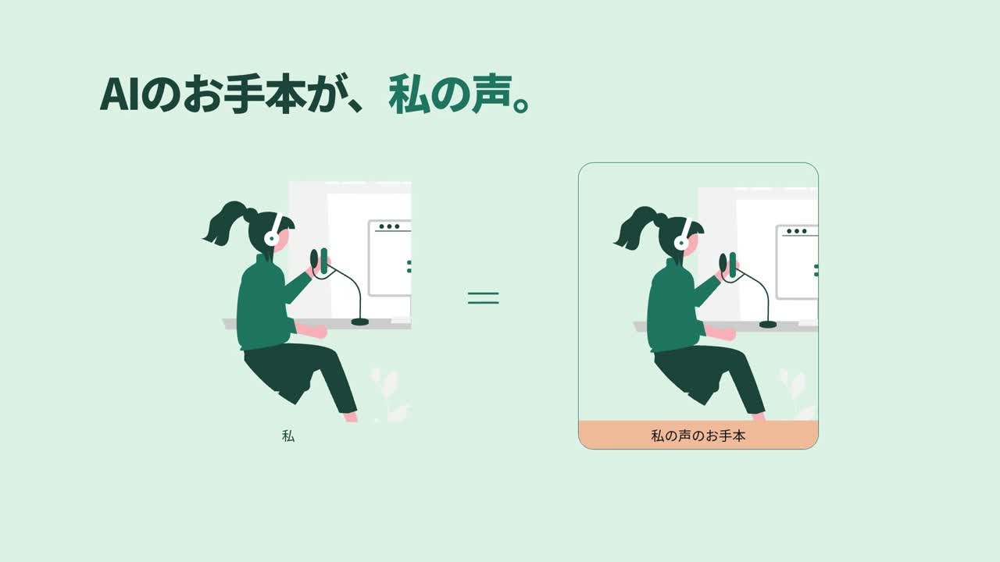

<div align="center">

# Tetsuya Creative Motions

**動画と、その作り方。**

コードとAIで作る映像の作品集。完成動画、台本、プロンプト、演出、編集ソースを一緒に残します。

[▶ ギャラリーを見る](https://videos.maepace.com/) · [作品一覧](#作品) · [スタイルを探す](styles/README.md) · [自分で作る](docs/REPRODUCE.md)

</div>

## 作品

<table><tr>
<td width="50%" valign="top"><a href="films/lanclo/"></a><br><b>Lanclo — シャドーイングの、その先へ。</b><br>0:53 · Product film<br>自分の声のお手本と、日常に溶け込む英語学習。<br><a href="films/lanclo/">制作ノートとプロンプト →</a></td>
<td width="50%" valign="top"><a href="films/lanclo-osaka/"></a><br><b>Lanclo — ワイの声で、ええやん。</b><br>0:57 · Osaka narration remix<br>同じ映像に、ぼやきとツッコミ。声と台本の実験。<br><a href="films/lanclo-osaka/">制作ノートとプロンプト →</a></td>
</tr></table>

完成動画はHTML/SVGとGSAPによるアニメーションをHyperFramesでレンダリング。人物はunDraw、ナレーションはGemini TTSを使用しています。

## この作品集の使い方

1. **作品から入る** — 気になるサムネイルから、ねらいと見どころを読む。
2. **プロンプトを見る** — `PROMPT.md`で全体の指示、`NARRATION.md`でセリフ、`TTS-PROMPTS.json`で演技指示を読む。
3. **スタイルを借りる** — `STYLE.md`を参考に、題材・ブランド・素材を自分のものへ置き換える。
4. **ソースを動かす** — [再編集手順](docs/REPRODUCE.md)に沿ってプレビューする。

`PROMPT.md`は制作中の判断を完成形へ統合した再制作用プロンプトです。最初に一度だけ入力した原文ではありません。音声生成入力は個人の登録IDを除いて保存しています。

## ギャラリー

ビルド不要の静的サイトを[`site/`](site/)に用意しています。サブドメインにもサブディレクトリにも配置できます。公開先：**https://videos.maepace.com/**。

```sh
npm run dev
# http://localhost:4173
```

手元に完成MP4がある場合は `site/media/lanclo.mp4` と `site/media/lanclo-osaka.mp4` に配置してください。完成MP4・音声はGitに含めず、[公開手順](docs/PUBLISHING.md)に沿って配信します。

## ファイル構成

```text
films/       作品ごとの説明・プロンプト・台本・編集ソース
styles/      次の作品にも使えるビジュアルスタイル
site/        ポートフォリオ用の動画ギャラリー
scripts/     ギャラリーのビルドと公開前チェック
docs/        再編集・公開・ライセンスの案内
templates/   新しい作品を追加する雛形
```

[新しい作品を追加する](docs/ADDING-A-FILM.md)

## 参考とライセンス

構成の参考は [Lemo-Opuscar](https://github.com/lemomo-ai/lemo-opuscar)。見本動画とスタイル、制作プロンプトをセットで見せる考え方を参考にしました。説明文とサイト実装はこの作品集向けに制作しています。

本リポジトリの自作コード・文書は[MIT](LICENSE)。動画、第三者素材、ブランド、本人の声には別の条件が適用されます。[ライセンスの適用範囲](docs/LICENSING.md)と各作品の `CREDITS.md` を確認してください。
