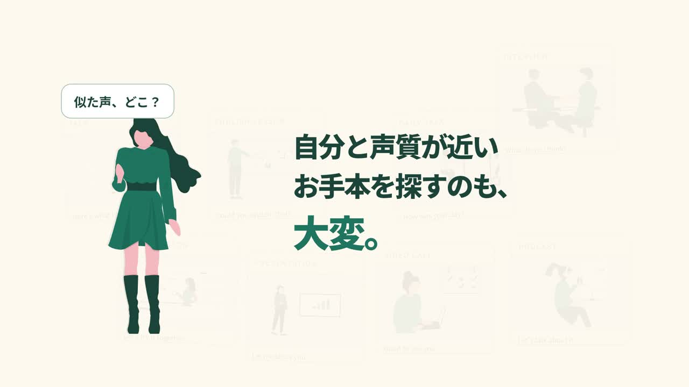

# Lanclo — ワイの声で、ええやん。

**0:57 · 1920×1080 · 30fps · たこ先生の登録音声・大阪弁**

同じ映像に、ぼやきとツッコミを。声と台本で印象が変わる、大阪弁ナレーション版。

[ギャラリー](https://videos.maepace.com/#lanclo-osaka) · [制作プロンプト](PROMPT.md) · [台本](NARRATION.md) · [スタイル](../../styles/warm-illustrated-keynote/STYLE.md) · [編集ソース](source/) · [音声入力](TTS-PROMPTS.json) · [タイミング](TIMING.json) · [出典](CREDITS.md)

[MP4をダウンロード](https://github.com/ted-M-tech/tetsuya-creative-motions/releases/download/films/lanclo-osaka.mp4)

## 見どころ

- 人物カードが積み重なり、似た声を探す悩みが「自分の声」という解決につながる。
- 研究結果は同じゼロ起点の棒グラフ。強調するのは得点の伸びの差。
- 夜のニュース収集から、朝の英語教材までを一連の動きで見せる。
- Language CloneからLancloへ文字が縮約するブランドエンディング。

## 再編集

[共通の再編集手順](../../docs/REPRODUCE.md)を参照。第三者素材は[CREDITS.md](CREDITS.md)の条件が適用されます。音声の再生成は別途APIアクセスが必要です。台本・演技指示は公開しますが、個人の登録音声IDと音声ファイルは公開用Gitに含めません。
